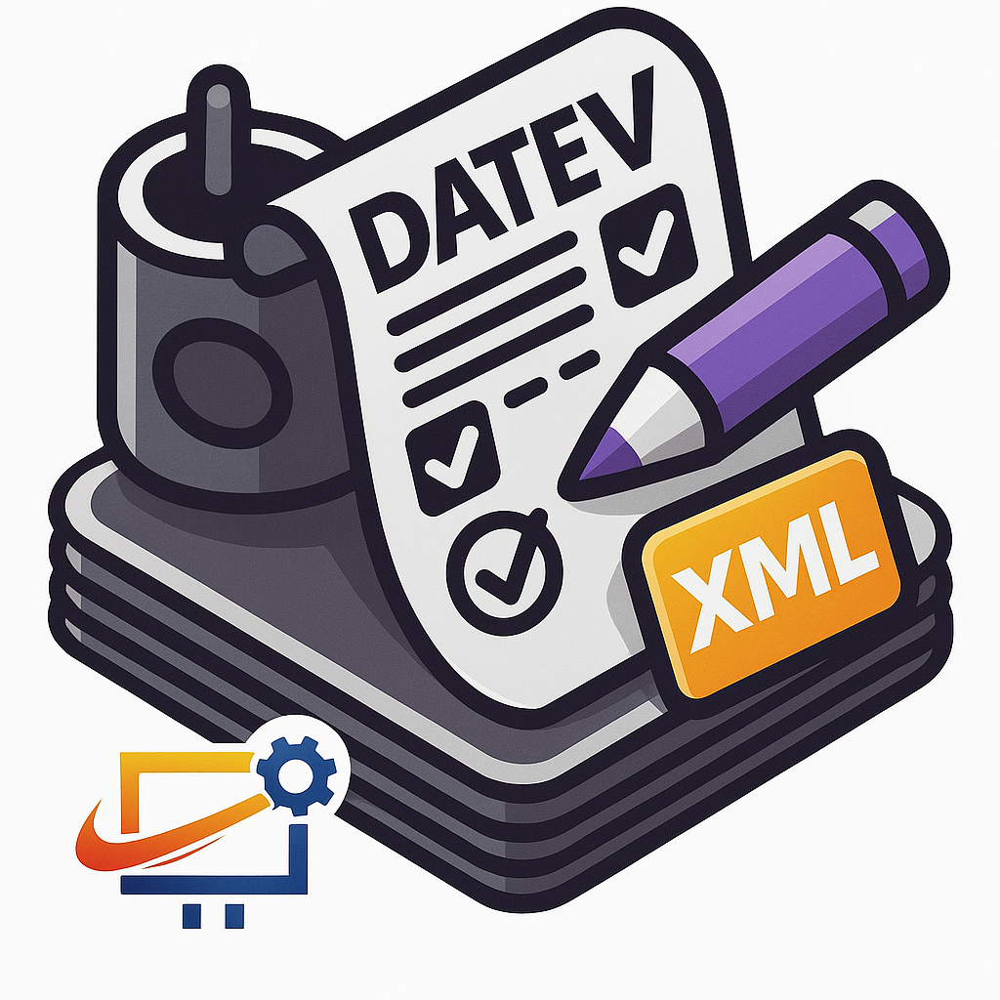
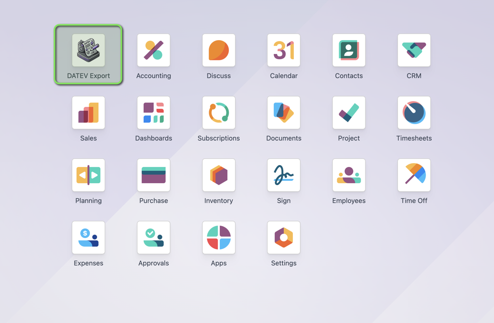
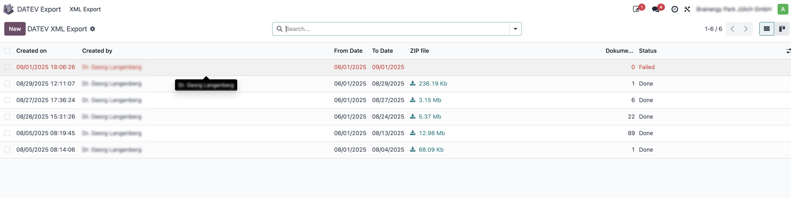
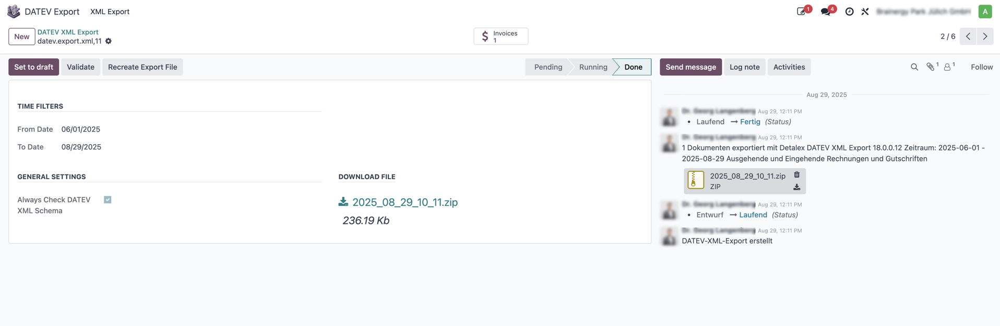

# ✨ DATEV XML Export für Odoo

**Exportiere Rechnungen und Belege einfach, intuitiv und prüfsicher in das DATEV XML-Format.**

Dieses Modul erweitert Odoo um einen professionellen DATEV-Export, der den modernen Anforderungen der digitalen Buchhaltung gerecht wird.

---

## 🚀 So funktioniert's: Der Export-Workflow

Der gesamte Prozess ist auf einen einfachen und schnellen Ablauf ausgelegt.

### 1. Startpunkt: Das Dashboard
Alles beginnt mit einem Klick auf die **DATEV Export** Kachel in deinem Haupt-Dashboard.

### 2. Übersicht: Deine Exporte
Du landest in einer übersichtlichen Liste, die dir alle bisherigen Exporte mit ihrem aktuellen Status anzeigt.

### 3. Der Export: Zeitraum wählen und validieren
Im Export-Formular wählst du den gewünschten Zeitraum aus. Das System sammelt automatisch alle noch nicht exportierten Belege.

---

## 💎 Hauptfunktionen

- **🗓️ Zeitraumbasierter Export:** Wähle einfach einen Zeitraum und das System findet die relevanten Belege.
- **✅ Intelligente Validierung:** Prüfe deine Daten vor dem Export auf DATEV-Konformität (Adressen, Steuernummern, PDF-Anhänge, Ländercodes etc.).
- **🐞 Klares Fehlermanagement:** Bei Fehlern wirst du direkt zu den problematischen Belegen geführt, um sie schnell und einfach zu korrigieren.
- **📦 Kompletter Download:** Erhalte ein ZIP-Archiv mit der fertigen XML-Datei und allen zugehörigen Beleg-PDFs – bereit für den Import in DATEV Unternehmen online.

---

## 💡 Wichtige Hinweise

> - **Stammdatenpflege:** Achte auf vollständige und korrekte Stammdaten (Partner, Steuern, Länder), um Fehler zu vermeiden.
> - **Validierung nutzen:** Führe vor jedem Export die Validierung aus. Das spart Zeit und verhindert Nacharbeiten.
> - **Direkte Korrektur:** Fehlerhafte Dokumente können direkt aus der Fehlerliste geöffnet und bearbeitet werden.

---

## 📜 Versionsgeschichte

Alle Versionen anzeigen

- **17.0.1.3:** Added UI help block for export_bu_code field with warnings and documentation link
- **17.0.1.2:** Fixed GitHub documentation links to point to public repository
- **17.0.1.1:** Added export_bu_code field for optional BU-Code (Buchungsschlüssel) export control
- **17.0.1.0:** Unified version mit Magic-Button-Validierung und umfassender Dokumentation
- **17.0.0.13:** Magic Button für DATEV-Validierungsfehler mit Animation und Gruppenrechten
- **17.0.0.12:** Refactoring von `datev_cost_category`, verbesserte Testabdeckung
- **17.0.0.11:** Entferntes `datev_export_state`-Feld und Referenzen
- **17.0.0.10:** Aufräumen von Buchungstext und Kurzbeschreibung der Rechnungszeilen
- **17.0.0.9:** Bugfixes in Tests und Übersetzungen
- **17.0.0.8:** Anpassungen am `datev_exported`-Feld und Pluralisierung
- **17.0.0.7:** Bugfix in Tests mit neuer PDF-Merge-Logik
- **17.0.0.6:** Mehrere PDF-Anhänge werden gemerged, Umbenennung Kunden-/Lieferantenexporte
- **17.0.0.5:** XML-Validierung vor Export hinzugefügt
- **17.0.0.4:** DATEV XML Export Menü zum Accountant-Menü hinzugefügt
- **17.0.0.3:** DATEV XML Export Menü ins Apps-Menü verschoben
- **17.0.0.2:** Bugfix im Rechnungs-Smart-Button
- **17.0.0.1:** DATEV XML Export Menü ins Hauptmenü aufgenommen
- **17.0.0.0:** Migration auf Odoo 17

---

## 👥 Entwickler & Kontakt

**Entwickelt von:**
- **Dietmar Hamm** ([hamm@detalex.de](mailto:hamm@detalex.de))
- **Alexander Milgrud** ([milgrud@detalex.de](mailto:milgrud@detalex.de))

**Unternehmen:**
- **Detalex GmbH**
- [Website](https://detalex.de) | [LinkedIn](https://www.linkedin.com/company/detalex-gmbh/) | [Instagram](https://www.instagram.com/detalex_gmbh/)
