# DATEV XML Export

**Version:** 18.0.1.0  
**Kategorie:** Accounting/Localizations  
**Autor:** Detalex GmbH, Dietmar Hamm (hamm@detalex.de)  
**Website:** https://detalex.de  
**Lizenz:** Other proprietary

## Beschreibung

Das **DATEV XML Export** Addon stellt erweiterte Funktionalitäten für den Export von Rechnungen und Belegen in das deutsche DATEV-System über die moderne XML-Schnittstelle mit Unterstützung für digitalisierte Belege bereit. Diese Lösung ermöglicht den strukturierten Transfer von Buchhaltungsdaten und ersetzt schrittweise die ASCII-basierten Exporte.

**🚀 Neu in Version 18.0:** Vollständige Kompatibilität mit Odoo 18.0, verbesserte Performance, erweiterte Magic Button Funktionalität mit verbesserter Validierung und modernisierte Benutzeroberfläche entsprechend den neuesten Odoo-Standards.

## Inhaltsverzeichnis

- [Funktionsübersicht](#funktionsübersicht)
- [Funktionen detailliert](#funktionen-detailliert)
  - [Export per Assistent](#export-per-assistent)
  - [Manueller Export](#manueller-export)
  - [Import in DATEV](#import-in-datev)
  - [DATEV Belegtransfer](#datev-belegtransfer)
  - [Dateien übertragen](#dateien-übertragen)
  - [Buchungssätze herunterladen](#buchungssätze-herunterladen)
- [Magic Button für DATEV Validierungsfehler](#magic-button-für-datev-validierungsfehler)
- [Installation und Voraussetzungen](#installation-und-voraussetzungen)
- [Konfiguration](#konfiguration)
- [Verwendung](#verwendung)
- [Technische Details](#technische-details)
- [Einschränkungen](#einschränkungen)
- [Fehlerbehebung](#fehlerbehebung)
- [DATEV-Integration](#datev-integration)
- [Entwickler-Hinweise](#entwickler-hinweise)
- [Support](#support)
- [Changelog](#changelog)

## Funktionsübersicht

### 1. Vollständiger DATEV XML Export
- **Ausgangsrechnungen**: Export von Kundenrechnungen mit allen Positionen
- **Eingangsrechnungen**: Export von Lieferantenrechnungen und Belegen
- **Gutschriften**: Vollständige Unterstützung für Gut- und Lastschriften
- **Digitalisierte Belege**: Automatische Verarbeitung von PDF-Anhängen

### 2. Export-Management
- **Zeitraumbasierter Export**: Export nach definierten Datumsbereichen
- **Einzelexport**: Direkter Export einzelner Rechnungen
- **Batch-Verarbeitung**: Massenexport mit Fortschrittsverfolgung
- **Export-Tracking**: Vollständige Nachverfolgung aller Exportvorgänge

### 3. Magic Button Funktionalität
- **🚨 Validierungsfehler-Button**: Zeigt problematische Rechnungen mit Animation
- **Export-Navigation**: Direkter Sprung zu exportierten Rechnungen
- **Schnelle Nachbesserung**: Einfache Korrektur fehlerhafter Belege
- **UX-Integration**: Nahtlose Benutzerführung im Buchhaltungsworkflow

### 4. DATEV-Validierung
- **XSD-Validierung**: Automatische Überprüfung gegen DATEV-Schema
- **Fehlerbehandlung**: Detaillierte Fehlermeldungen und Korrekturhinweise
- **Automatische Bereinigung**: Löschen von Validierungsfehlern bei erfolgreicher Korrektur
- **Gruppenbeschränkungen**: Schutz sensibler DATEV-Informationen

### 5. PDF-Verarbeitung
- **Automatisches Merging**: Zusammenführung mehrerer PDF-Anhänge
- **Attachment-Handling**: Intelligente Verarbeitung von Beleganhängen
- **Qualitätskontrolle**: Überprüfung der PDF-Integrität
- **Komprimierung**: Optimierte Dateigröße für Transfer

### 6. Integration & Kompatibilität
- **DATEV Unternehmen Online**: Kompatibel mit der DATEV-Plattform
- **Document Transfer App**: Unterstützung für DATEV Transfer-App
- **XML-Standard**: Einhaltung des DATEV XML-Formats
- **Deutsche Lokalisierung**: Vollständige l10n_de Integration

## Funktionen detailliert

### ⚠️ Einschränkungen der DATEV XML-Schnittstelle

Die DATEV XML-Schnittstelle kann folgende Anwendungsfälle nicht abdecken:

- Reine Sachkontenbuchungen (Sachkonto zu Sachkonto, z.B. Zahlungsbuchungen)
- Stammdatenübertragung für Geschäftspartner (Kunden/Kreditoren)
- Bestimmte §13b UStG-Fälle (siehe zulässige Steuercodes für DATEV Unternehmen Online)

### Export per Assistent

Der Hauptexport erfolgt über den **DATEV XML Export** Assistenten, der über das Menüelement **Rechnungsstellung > Berichte > DATEV XML Export** ausgeführt werden kann.

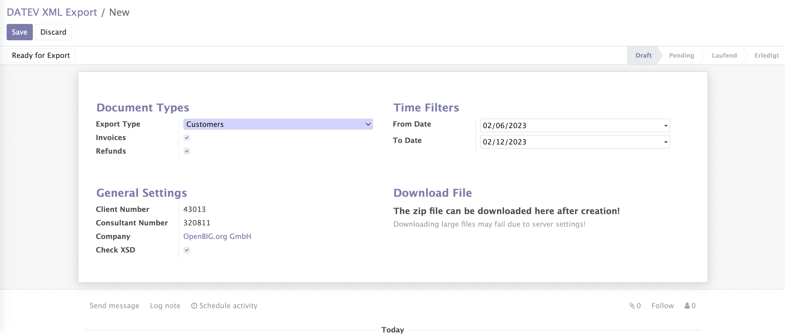

Im Assistenten können Sie nach *Rechnungstypen* filtern und den *Zeitraum* begrenzen. In den *Allgemeinen Einstellungen* können Sie Ihr Unternehmen auswählen und festlegen, ob Sie die XML-Exportdatei durch das bereitgestellte XSD-Schema validieren möchten (Empfohlen).

> **Wichtig:** Für einen gültigen Import bei DATEV ist es sehr wichtig, dass die Exportdatei die Anforderungen erfüllt! Stellen Sie daher sicher, dass diese Flagge gesetzt ist, wenn Sie Ihre *ZIP-Exportdatei* auf ein produktives DATEV-System hochladen möchten.

Klicken Sie auf die Schaltfläche **DATEV XML-Exportdatei erstellen**, um die ZIP-Datei für den ausgewählten Filter im Hintergrund zu erstellen.

### Manueller Export

Es ist auch möglich, ausgewählte Rechnung(en) oder Gutschrift(en) über das *Aktions-Dropdown* der Rechnungen/Gutschriften zu exportieren. Als Ergebnis können Sie eine ZIP-Datei herunterladen, die bereit für die Übertragung zu DATEV Unternehmen Online ist.

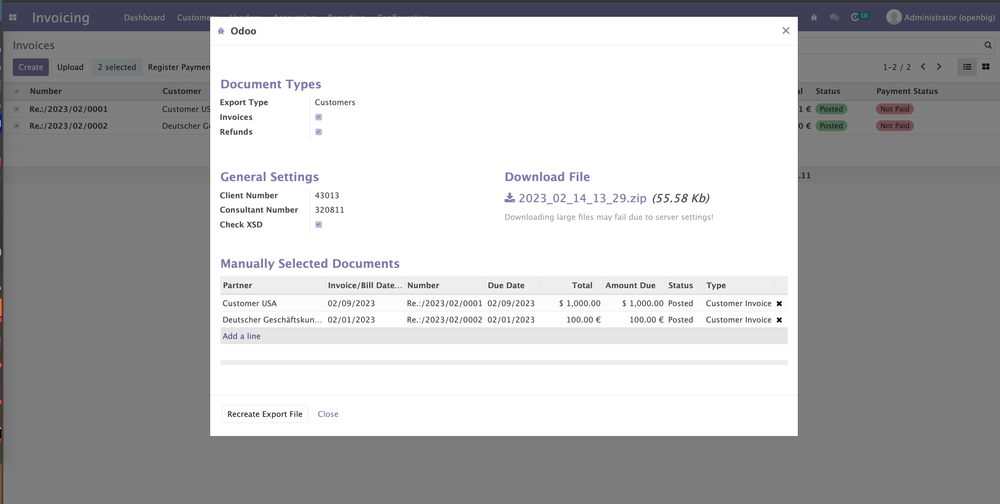

Wenn Sie einen manuellen Export aus der Lieferantenrechnungsliste erstellen, ist der Exporttyp „Eingangsrechnungen". Wenn Sie diesen Export aus den Kundenrechnungen erstellen, ist der Exporttyp „Ausgangsrechnungen".

Bei aktivierter XSD-Prüfung können einige Fehler auftreten:

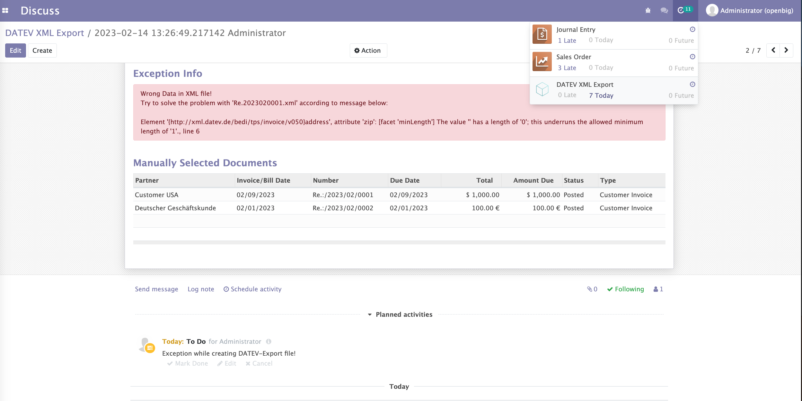

> **Hinweis:** Die Dauer der Dateierstellung hängt von der Anzahl der Rechnungen/Gutschriften ab, für die Sie die ZIP-Datei erstellen!

### Import in DATEV

#### Voraussetzungen

**1.) DATEV Unternehmen Online** ist für den Mandanten aktiviert. Stellen Sie sicher, dass Sie die folgenden "Erweiterten Einstellungen" in DATEV Unternehmen Online konfiguriert haben:

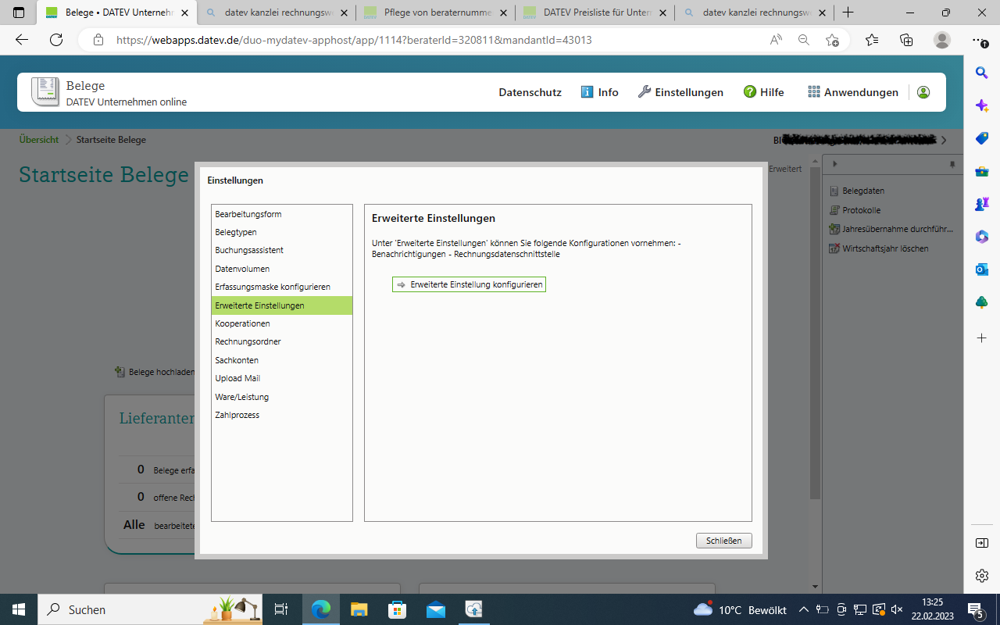

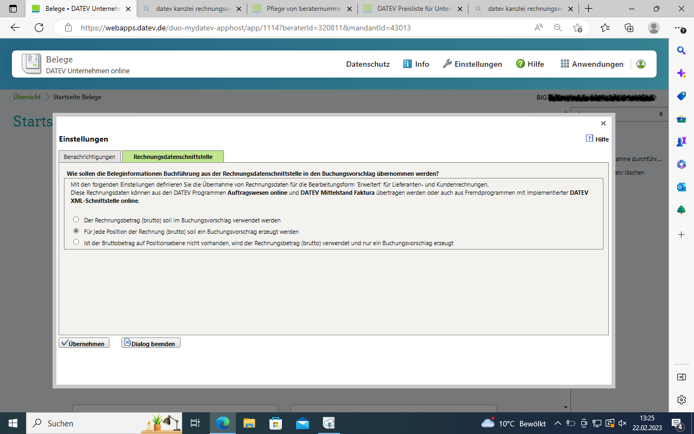

**2.) Das DATEV Belegtransfer-Programm** ist installiert und geöffnet.

#### Übertragung zum Steuerberater

Die ZIP-Datei mit den Belegbildern wird zunächst aus Odoo exportiert und auf dem Computer des Mandanten gespeichert. Die Dateien können dann auf 3 verschiedene Arten zum Steuerberater übertragen werden:

**1. Weg:** Übertragung von Belegen und Buchungssätzen mit DATEV Belegtransfer

**2. Weg:** Übertragung von Belegen und Buchungssätzen außerhalb von DATEV

### DATEV Belegtransfer

Um das .zip-Archiv aus Odoo zu übertragen, muss das DATEV Belegtransfer-Programm installiert und geöffnet sein.

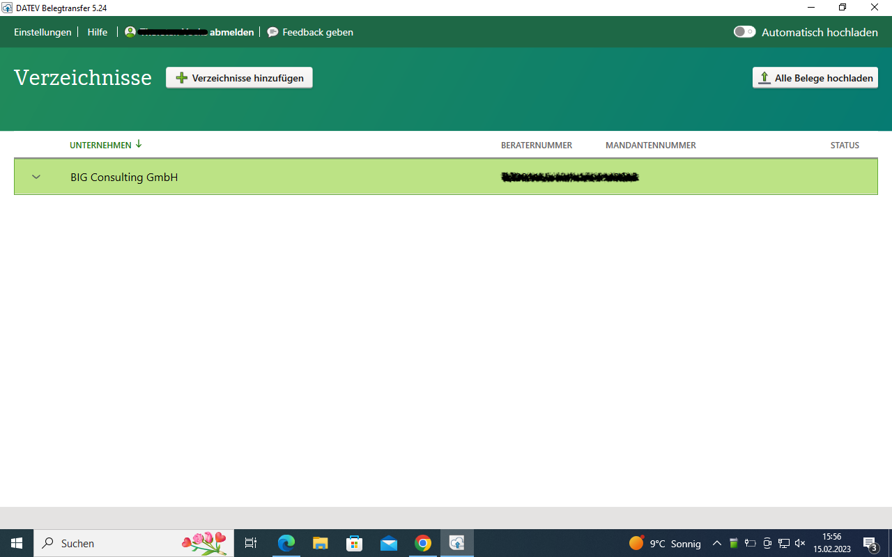

**1.) "Verzeichnisse anlegen" Dialog:** Geben Sie an, wo die Verzeichnisse gespeichert werden sollen, wie das Firmenverzeichnis benannt werden soll und ob Sie die Quelldateien nach dem Upload löschen oder archivieren möchten.

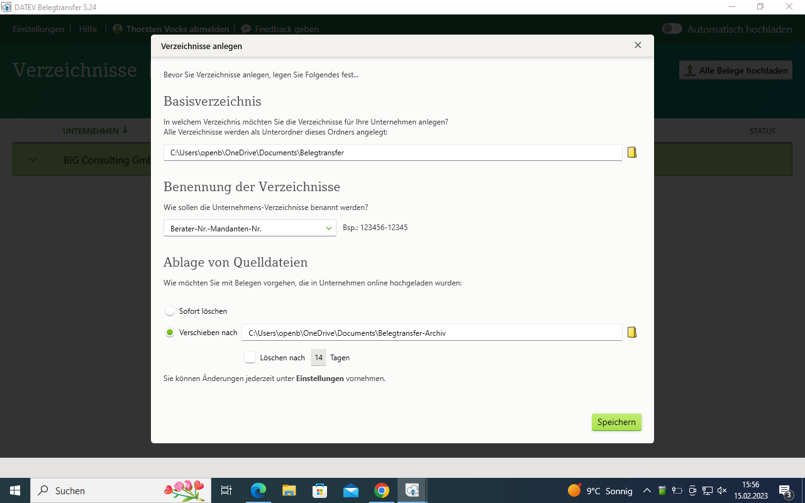

**2.) Verzeichnisse definieren:** Wählen Sie zunächst den Mandanten aus und klicken Sie dann auf "Weiter". Konfigurieren Sie die Verzeichnisse wie folgt:

- **Rechnungseingang:** Aktivieren Sie "Als Verzeichnis anlegen" und "Als XML-Schnittstelle konfigurieren"
- **Rechnungsausgang:** Aktivieren Sie "Als Verzeichnis anlegen" und "Als XML-Schnittstelle konfigurieren"

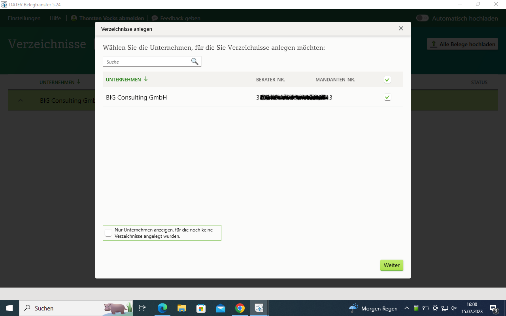

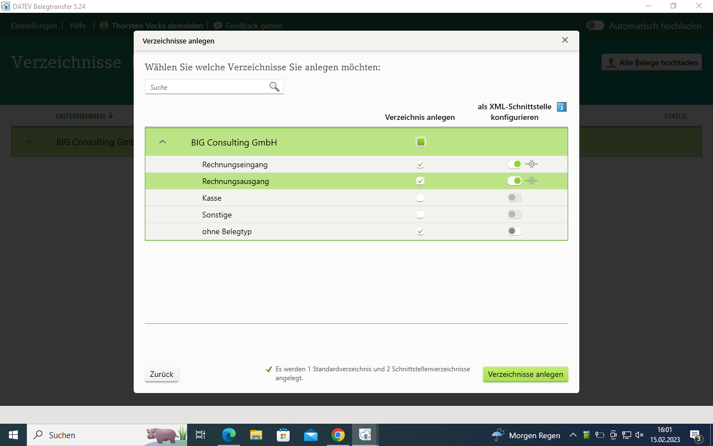

### Dateien übertragen

**1.) Dateien platzieren:** Doppelklicken Sie auf das entsprechende Verzeichnis ("Rechnungseingang" oder "Rechnungsausgang"). Platzieren Sie die Datei am Speicherort:

- ZIP-Datei für Ausgangsrechnungen aus Odoo → Verzeichnis "Ausgangsrechnungen" (mit aktivierter XML-Schnittstelle)
- ZIP-Datei für Eingangsrechnungen aus Odoo → Verzeichnis "Eingangsrechnungen" (mit aktivierter XML-Schnittstelle)

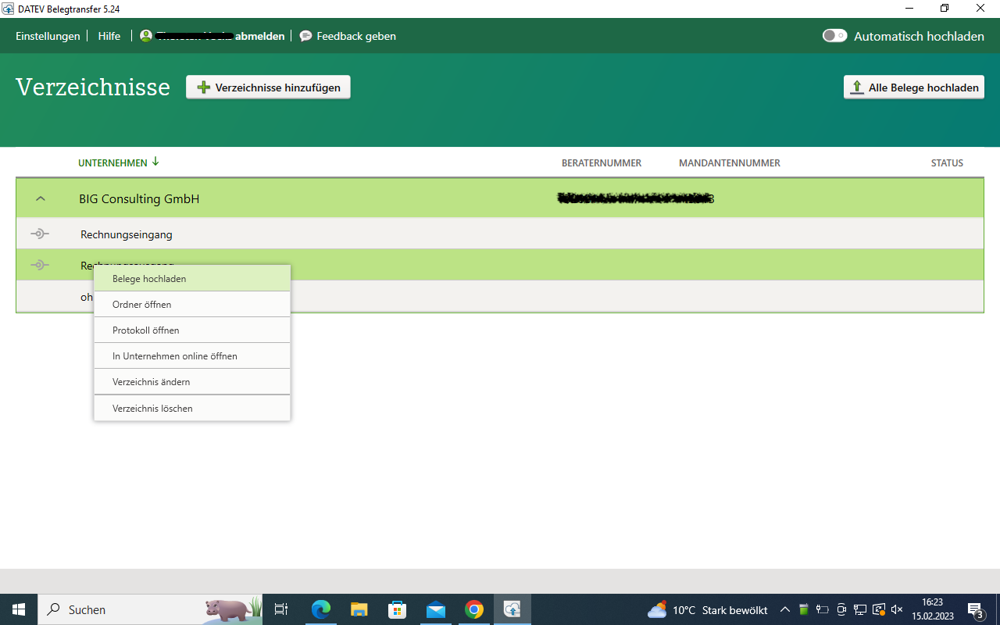

**2.) Upload:** Rechtsklick auf das Verzeichnis → "Belege hochladen" wählen.

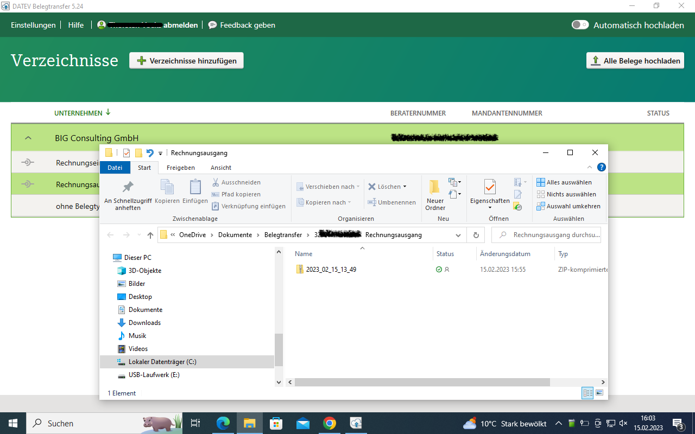

**3.) Upload-Erfolg prüfen:** Rechtsklick auf das Verzeichnis → "Protokoll öffnen" → "Import-Protokoll" für Details.

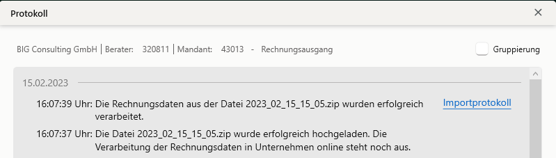

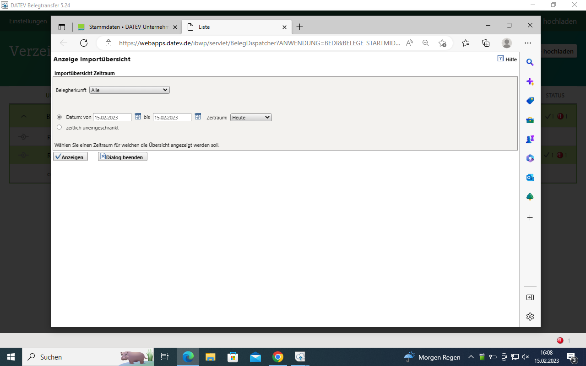

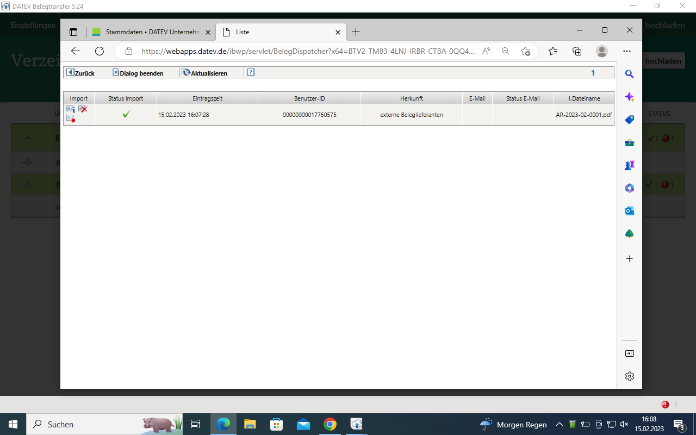

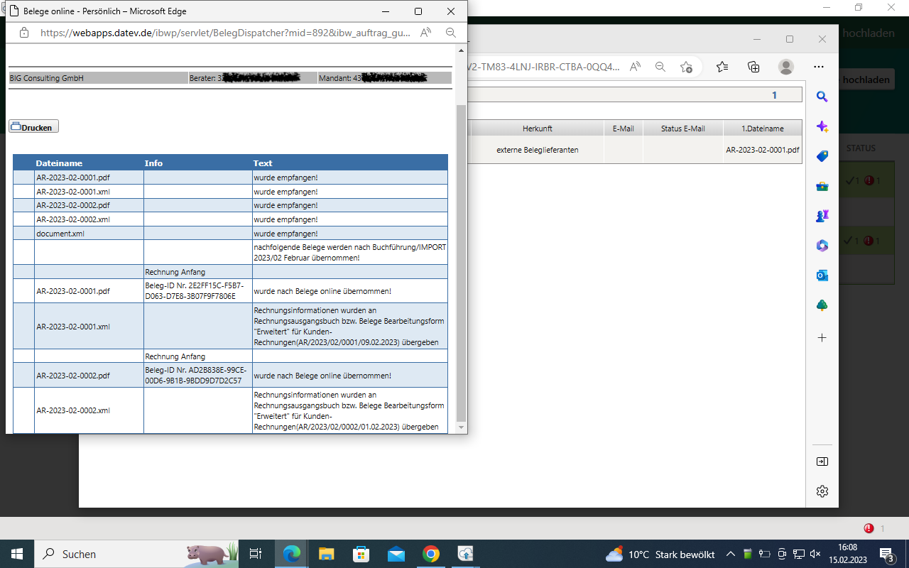

**4.) Wiederholen:** Wiederholen Sie die Schritte 1 bis 3 mit dem anderen Verzeichnis, falls Sie beide Rechnungstypen hochladen möchten.

#### Import-Überprüfung in DATEV Unternehmen Online

DATEV Unternehmen Online erkennt automatisch, dass der Inhalt der ZIP-Datei Belege sind, die zu einem Buchungsstapel gehören, und importiert sie automatisch. Weitere Aktionen durch den Steuerberater sind nicht erforderlich.

**Überprüfung des automatischen Belegimports:**
Anwendungen → Belege → Rechtes Seitenmenü → Protokolle → Import → Import-Protokoll anzeigen → Import-Datum auswählen und "Anzeigen"

### Buchungssätze herunterladen

**1.) In DATEV Unternehmen Online:**

Die Position "Bereitstellen" befindet sich auf der Belege-Startseite in DATEV Unternehmen Online.

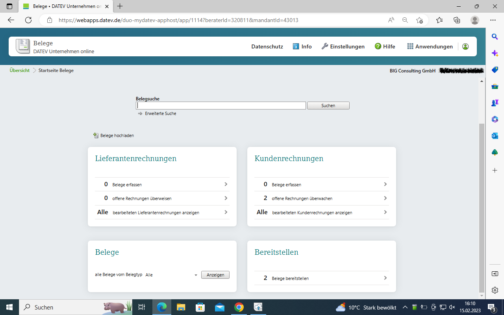

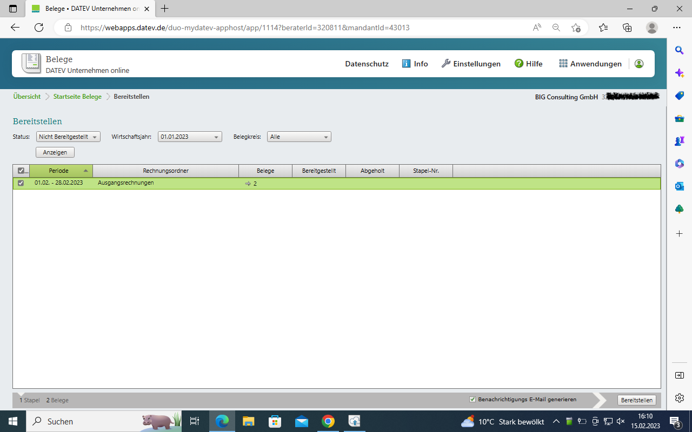

**2.) In DATEV Kanzlei-Rechnungswesen:** Die bereitgestellten Daten müssen über Mandantenzusatz abgeholt werden.

#### Umgang mit Fehlern in Buchungen

Bei Fehlern in den Buchungen wird empfohlen, diese an der Quelle (in Odoo) zu bearbeiten und dann einen korrigierten Buchungsstapel bereitzustellen.

### Aktuelle Einschränkungen & Ausblick

#### Empfohlene Konteneinrichtung

- **Debitorenkonten:** Verwenden Sie DATEV-Nummerlogik (z.B. Standard 1410/1205 → 69999 ändern)
- **Kreditorenkonten:** Verwenden Sie DATEV-Nummerlogik (z.B. Standard 1610/3301 → 99999 ändern)

#### Geplante Erweiterungen

- Zusätzliche Felder "DATEV Debitor" und "DATEV Kreditor" am Partner
- Export-Typ "Belegdaten" → "Stapel" für erweiterte Buchungsdaten
- Verbesserter Umgang mit DATEV-Automatikkonten

#### Empfehlungen für vollständige Buchhaltung

Wenn Sie Odoo als vollständige Buchhaltungslösung verwenden möchten, wird empfohlen, die Odoo- und DATEV-Saldenliste nach jedem Monat abzugleichen.

## Magic Button für DATEV Validierungsfehler

### Übersicht

Das DATEV XML Export Modul wurde mit einem **magischen Button** ausgestattet, der bei Validierungsfehlern erscheint und direkt zur Liste der problematischen Rechnungen führt.

### ✨ Magische Button-Features
- **Erscheint nur bei Fehlern**: Der Button ist nur sichtbar, wenn `problematic_invoices_count > 0`
- **Auffälliges Design**: Roter Gradient mit Puls-Animation und Shine-Effekt
- **Hover-Effekte**: Lift-Animation beim Überfahren mit der Maus
- **Emoji-Integration**: 🚨 Symbol für sofortige Erkennung

### 📋 Verbesserte Fehler-Liste
- **Rote Hervorhebung**: Alle fehlerhaften Rechnungen werden rot dargestellt
- **Zusätzliche Informationen**: Kunde, Datum, Betrag und Status werden angezeigt
- **Readonly-Modus**: Verhindert versehentliche Änderungen in der Fehler-Ansicht
- **Dynamischer Titel**: Zeigt die genaue Anzahl der Fehler im Fenstertitel

### Workflow des Magic Buttons
1. **DATEV Export starten** → Validierung läuft im Hintergrund
2. **Bei Fehlern** → Magic Button erscheint automatisch
3. **Button klicken** → Direkte Weiterleitung zur Fehler-Liste
4. **Fehler beheben** → Zurück zum Export und erneut validieren

### Visuelle Hinweise
- **Rote Färbung**: Sofortige Erkennung von Problemen
- **Puls-Animation**: Aufmerksamkeit wird auf den Button gelenkt
- **Emoji-Icons**: Universell verständliche Symbolik
- **Hover-Feedback**: Interaktive Bestätigung

### Technische Implementierung

#### Backend (models/datev_export.py)
```python
def action_show_invalid_invoices_view(self):
    """🚨 Magischer Button: Zeigt alle Rechnungen mit Validierungsfehlern"""
    list_view = self.env.ref("dtx_datev_export_xml.view_move_datev_validation")
    error_count = self.problematic_invoices_count

    return {
        "type": "ir.actions.act_window",
        "view_mode": "list,form",
        "views": [[list_view.id, "list"], [False, "form"]],
        "res_model": "account.move",
        "target": "current",
        "name": _("🚨 DATEV Validierungsfehler ({} Rechnungen)").format(error_count),
        "domain": [("id", "in", self.invoice_ids.filtered("datev_validation").ids)],
        "context": {
            "search_default_datev_validation": 1,
            "create": False,
            "edit": False,
        }
    }
```

#### Frontend (views/datev_export_views.xml)
```xml
<button
    class="oe_stat_button magic-error-button"
    name="action_show_invalid_invoices_view"
    icon="fa-exclamation-triangle"
    type="object"
    invisible="problematic_invoices_count == 0"
    title="🚨 Magischer Button: Direkt zu den Validierungsfehlern springen!"
    style="animation: pulse 2s infinite;"
>
    <div class="o_form_field o_stat_info">
        <span class="o_stat_value">
            🚨 <field name="problematic_invoices_count" />
        </span>
        <span class="o_stat_text">Validierungsfehler</span>
    </div>
</button>
```

#### CSS-Animationen (static/src/css/datev_magic_button.css)
```css
/* Pulse-Animation */
@keyframes pulse {
    0% { box-shadow: 0 0 0 0 rgba(220, 53, 69, 0.7); }
    70% { box-shadow: 0 0 0 10px rgba(220, 53, 69, 0); }
    100% { box-shadow: 0 0 0 0 rgba(220, 53, 69, 0); }
}

/* Shine-Effekt */
@keyframes shine {
    0% { left: -100%; }
    50% { left: 100%; }
    100% { left: 100%; }
}

/* Magic Button Styling */
.magic-error-button {
    background: linear-gradient(135deg, #dc3545, #c82333) !important;
    box-shadow: 0 4px 8px rgba(220, 53, 69, 0.4);
    animation: pulse 2s infinite;
}

.magic-error-button:hover {
    transform: translateY(-2px);
    box-shadow: 0 6px 12px rgba(220, 53, 69, 0.6);
}
```

### Validierungsfehler-Typen
- **XML-Schema Verstöße**: Falsche Datentypen oder fehlende Felder
- **Ländercode-Probleme**: Ungültige ISO-Codes
- **Konto-Validierung**: Falsche Kontonummern oder fehlende Zuordnungen

## Installation und Voraussetzungen

### Systemvoraussetzungen
- **Odoo Version**: 18.0 oder höher
- **Python Version**: 3.10+
- **PostgreSQL**: 13+
- **Betriebssystem**: Linux, Windows, macOS
- **RAM**: Mindestens 4GB empfohlen
- **Speicher**: 2GB freier Speicherplatz für Export-Dateien

### Erforderliche Module
Stellen Sie sicher, dass folgende Module installiert sind:
- `dtx_datev_export` (Basis-Modul - wird automatisch installiert)
- `account` (Buchhaltung)
- `stock` (Lager)
- `l10n_de` (Deutsche Lokalisierung für Odoo 18.0)
- `contacts` (Kontakte)

### Installation
1. **Automatische Installation**: Installieren Sie das Modul über die App-Verwaltung von Odoo 18.0
2. **Kommandozeile**: `odoo -i dtx_datev_export_xml -d your_database`
3. Das Basis-Modul `dtx_datev_export` wird automatisch mit installiert
4. **Datenbank-Migration**: Bei Update von 17.0 wird automatisch migriert
5. Konfigurieren Sie Ihre DATEV-Einstellungen

## Konfiguration

### DATEV-Grundeinstellungen
1. **Einstellungen → Buchhaltung → DATEV Export**
2. Tragen Sie ein:
   - **Berater-Nummer**: Ihre DATEV Beraternummer (1000-9999999)
   - **Mandanten-Nummer**: Ihre DATEV Mandantennummer (0-99999)

### XML-Export-Einstellungen
1. **Buchhaltung → Konfiguration → DATEV XML Export**
2. Konfigurieren Sie:
   - **Export-Verzeichnis**: Pfad für generierte Dateien
   - **Validierung**: Aktivierung der XSD-Überprüfung
   - **PDF-Optionen**: Zusammenführung und Komprimierung

### Benutzerberechtigungen
- **DATEV Export User**: Kann Exporte erstellen und durchführen
- **DATEV Export Manager**: Vollzugriff auf alle Export-Funktionen
- **Accounting Manager**: Zusätzlich DATEV-Validierung in Rechnungsansicht

## Verwendung

### Einzelexport
1. Öffnen Sie eine Rechnung
2. Klicken Sie auf **"DATEV XML Export"**
3. Die Rechnung wird validiert und exportiert
4. ZIP-Datei wird automatisch generiert

### Zeitraumexport
1. **Buchhaltung → DATEV → XML Export**
2. Erstellen Sie einen neuen Export
3. Wählen Sie den gewünschten Zeitraum
4. Starten Sie den Export
5. Überwachen Sie den Fortschritt

### Magic Buttons verwenden
- **🚨 Validierungsfehler**: Zeigt Rechnungen mit DATEV-Fehlern
- **Exportierte Rechnungen**: Direkter Zugriff auf bereits exportierte Belege
- **Fehlerkorrektur**: Schnelle Navigation zu problematischen Datensätzen

## Technische Details

### Modell-Erweiterungen

#### datev.export.xml
Hauptmodell für Export-Management:
```python
class DatevExport(models.Model):
    _name = "datev.export.xml"
    _inherit = ["mail.thread", "mail.activity.mixin", "datev.zip.generator"]
    _description = "DATEV XML Export"
```

#### account.move
Erweitert Rechnungen um DATEV-Funktionalität:
- `datev_exported`: Export-Status-Verfolgung
- `datev_validation_errors`: Validierungsfehler-Tracking
- DATEV XML Export-Methoden

### Datenstrukturen
- **data/**: Cron-Jobs für automatische Verarbeitung
- **security/**: Benutzergruppen und Zugriffsrechte
- **views/**: UI-Erweiterungen und Export-Formulare
- **xsd_files/**: DATEV XML Schema-Definitionen
- **static/**: CSS für Magic Button-Animationen

### Export-Workflow
1. **Validierung**: XSD-Schema-Überprüfung
2. **XML-Generierung**: Strukturierte Datenerstellung
3. **PDF-Verarbeitung**: Anhang-Zusammenführung
4. **ZIP-Erstellung**: Finale Paket-Generierung
5. **Übertragung**: Bereitstellung für DATEV Transfer

### Assets-Integration
```python
"assets": {
    "web.assets_backend": [
        "dtx_datev_export_xml/static/src/css/datev_magic_button.css",
    ],
}
```

## Einschränkungen

Das DATEV XML Interface deckt folgende Anwendungsfälle **nicht** ab:
- **Reine Sachkontenbuchungen** (Sachkonto zu Sachkonto, z.B. Zahlungsbuchungen)
- **Stammdatenübertragung** für Geschäftspartner (Kunden/Kreditoren)
- **Bestimmte §13b UStG-Fälle** (siehe zulässige Steuercodes für DATEV Unternehmen Online)

Für diese Fälle verwenden Sie bitte die entsprechenden DATEV ASCII Export-Module oder manuelle Übertragung.

## Fehlerbehebung

### Häufige Probleme

#### Validierungsfehler
- **Problem**: Rechnung wird nicht exportiert
- **Lösung**: Magic Button 🚨 verwenden, Fehler korrigieren, erneut exportieren

#### PDF-Probleme
- **Problem**: PDF-Anhänge fehlen im Export
- **Lösung**: Überprüfen Sie die Anhang-Konfiguration und PDF-Zusammenführung

#### Export-Berechtigung
- **Problem**: Export-Button nicht sichtbar
- **Lösung**: Prüfen Sie Benutzergruppen-Zugehörigkeit (DATEV Export User)

### Debugging und Logs
Aktivieren Sie das Logging für `dtx_datev_export_xml` um detaillierte Informationen zu erhalten:
```python
_logger = logging.getLogger(__name__)
```

### Datenfluss des Magic Buttons
1. `problematic_invoices_count` wird berechnet basierend auf `invoice_ids.filtered("datev_validation")`
2. Button ist nur sichtbar wenn `problematic_invoices_count > 0`
3. Klick führt `action_show_invalid_invoices_view()` aus
4. Spezielle List-View `view_move_datev_validation` wird geöffnet
5. Domain filtert nur Rechnungen mit `datev_validation != False`

## DATEV-Integration

### Voraussetzungen

#### 1. DATEV Unternehmen Online Aktivierung
DATEV Unternehmen Online muss für den Mandanten aktiviert sein. (Um die Belege einfach zu importieren, ist es nicht notwendig, dass der Mandant selbst Zugang zu DATEV Unternehmen Online hat). Stellen Sie sicher, dass Sie die folgenden "Erweiterten Einstellungen" in DATEV Unternehmen Online konfiguriert haben, um den Import von geteilten Kontobewegungen mit vielen Rechnungspositionen aus Rechnungen/Belegen zu ermöglichen:

**Wichtige Konfiguration der Rechnungsdatenschnittstelle:**
- Aktivieren Sie die XML-Schnittstelle für Eingangs- und Ausgangsrechnungen
- Konfigurieren Sie die erweiterten Einstellungen für Belegtransfer
- Stellen Sie sicher, dass die Rechnungsdatenschnittstelle aktiviert ist

#### 2. DATEV Belegtransfer Installation
Das DATEV Belegtransfer Programm muss installiert und geöffnet sein.

### DATEV Belegtransfer Konfiguration

#### Verzeichnisse anlegen
Um die ZIP-Archive aus Odoo zu übertragen, muss das DATEV Belegtransfer Programm installiert und geöffnet sein. In der geöffneten DATEV Belegtransfer Anwendung können Sie auf "Verzeichnisse anlegen" klicken und folgende Einstellungen vornehmen:

1. **"Verzeichnisse anlegen" Dialog**: Geben Sie an, wo die Verzeichnisse gespeichert werden sollen, wie das Firmenverzeichnis benannt werden soll und ob Sie die Quelldateien nach dem Upload löschen oder archivieren möchten. Klicken Sie dann auf "Speichern".

2. **Verzeichnisse definieren**: Definieren Sie nun die Verzeichnisse, die verwendet werden sollen, indem Sie zuerst den Mandanten auswählen und dann auf "Weiter" klicken. Sie können nun die beiden folgenden vorgeschlagenen Einträge verwenden und wie folgt konfigurieren:

   - **Rechnungseingang aktivieren**: "Als Verzeichnis anlegen". Aktivieren Sie auch "Als XML-Schnittstelle konfigurieren". Um die XML-Schnittstelle zu aktivieren, schieben Sie den Regler in der Spalte "Als XML-Schnittstelle konfigurieren" nach rechts. Dann ist er grün. Die Einstellung ist wichtig für die Übertragung der Dateien.
   
   - **Rechnungsausgang aktivieren**: "Als Verzeichnis anlegen". Aktivieren Sie auch "Als XML-Schnittstelle konfigurieren". Um die XML-Schnittstelle zu aktivieren, schieben Sie den Regler in der Spalte "Als XML-Schnittstelle konfigurieren" nach rechts. Dann ist er ebenfalls grün.

### Dateien übertragen

#### Upload-Prozess
1. **Verzeichnis auswählen**: Doppelklicken Sie auf das Verzeichnis "Rechnungseingang" oder "Rechnungsausgang". Der Speicherort für die hochzuladenden Dateien öffnet sich.

2. **Dateien platzieren**: Platzieren Sie die Datei am Speicherort. Achten Sie darauf, dass Sie die Dateien in das richtige Verzeichnis legen:
   - **ZIP-Datei für Ausgangsrechnungen** aus Odoo in das Verzeichnis mit aktivierter XML-Schnittstelle "Ausgangsrechnungen"
   - **ZIP-Datei für Eingangsrechnungen** aus Odoo in das Verzeichnis mit aktivierter XML-Schnittstelle "Eingangsrechnungen"

3. **Upload starten**: Rechtsklick auf das Verzeichnis → "Belege hochladen". Das Hochladen löscht die Dateien aus dem Verzeichnis oder verschiebt sie in einen Archivordner.

4. **Upload überprüfen**: Rechtsklick auf das Verzeichnis → "Protokoll öffnen" → "Import-Protokoll" für Details

### Übertragung an den Steuerberater

Die ZIP-Datei mit den Belegbildern wird zunächst aus Odoo exportiert und auf dem Rechner des Mandanten gespeichert. Die Dateien können dann auf 3 verschiedene Arten an den Steuerberater übertragen werden:

#### 1. Weg: Übertragung von Belegen und Buchungssätzen mit DATEV Belegtransfer
Der Mandant lädt sowohl die ZIP-Datei mit den Belegen als auch die CSV-Datei mit den Buchungssätzen (Buchungsstapel) in DATEV Belegtransfer hoch. Die ZIP-Datei mit den Belegen wird automatisch importiert. Die Rechnungen mit den Belegdaten landen in DATEV Unternehmen Online.

#### 2. Weg: Übertragung von Belegen und Buchungssätzen außerhalb von DATEV
Der Mandant überträgt sowohl die ZIP-Datei mit den Belegen unabhängig vom DATEV-Belegtransfer, z.B. per E-Mail oder auf einem USB-Stick. Der Steuerberater importiert die ZIP-Datei mit den Belegen in DATEV Belegtransfer.

### DATEV Unternehmen Online Integration

#### Automatischer Import
DATEV Unternehmen Online erkennt automatisch, dass der Inhalt der ZIP-Datei Belege sind, die zu einem Buchungsstapel gehören, und importiert sie automatisch. Weitere Aktionen des Steuerberaters sind nicht erforderlich.

#### Buchungssätze bereitstellen
In DATEV Unternehmen Online befindet sich die Position "Bereitstellen" auf der Belege-Startseite. Der aus Odoo exportierte und über DATEV Belegtransfer hochgeladene Buchungsstapel für "Eingangsrechnungen" und "Ausgangsrechnungen" kann hier markiert werden, um sie durch Klick auf "Bereitstellen" für DATEV Kanzlei-Rechnungswesen abrufbereit zu machen.

#### Buchungssätze abrufen
In DATEV Kanzlei-Rechnungswesen müssen diese bereitgestellten Daten über Mandantenergänzung abgerufen werden:
- Unter "Vorbereitende Tätigkeiten" → "Mandant hinzufügen" klicken
- Position "Kasse/Rechnungsstapel aus Kassenbuch/Belege online" auswählen
- Prozess mit "Daten abholen" starten
- Funktion "Buchungsvorschläge bearbeiten" verwenden

### Workflow-Integration
- **Eingangsrechnungen**: Ordner "Eingangsrechnungen" mit aktivierter XML-Schnittstelle
- **Ausgangsrechnungen**: Ordner "Ausgangsrechnungen" mit aktivierter XML-Schnittstelle
- **Fehlerbehandlung**: Separate Verarbeitung problematischer Belege

### Aktuelle Einschränkungen und Ausblick

#### Kontenlogik
Es wird derzeit empfohlen, ein Debitorenkonto nach DATEV-Nummerlogik für Debitorenkonten als Standard-Odoo-Debitorenkonto zu verwenden. Dazu können Sie einfach die Nummer des bestehenden Standard-Debitorenkontos ändern (z.B. 1410/1205 → 69999). Entsprechend wird für Kreditorenkonten ein Kreditorenkonto nach DATEV-Nummerlogik als Standard-Odoo-Kreditorenkonto empfohlen (z.B. 1610/3301 → 99999).

#### Zukünftige Entwicklungen
In zukünftigen Versionen ist geplant, optional zwei zusätzliche Felder am Partner zu haben: "DATEV Debitor" und "DATEV Kreditor". Diese Konten sollen automatisch zugewiesen werden können, wenn sie erstellt werden.

#### Weitere Exporttypen
Anstelle des DATEV XML-Formattyps "Rechnungsdaten" soll auch der Typ "Hauptbuch" optional wählbar sein. Dieser Typ umfasst einen erweiterten Export von Buchungsdaten, z.B. Wechselkurse für Währungen etc.

### Fehlerbehandlung in Buchungen
Bei Fehlern in den Buchungen wird empfohlen, diese an der Quelle, also in Odoo, zu bearbeiten und dann einen korrigierten Buchungsstapel bereitzustellen.

## Entwickler-Hinweise

### Erweiterung des Moduls
Um das Modul zu erweitern:
1. Fügen Sie `dtx_datev_export_xml` zu Ihren Abhängigkeiten hinzu
2. Erweitern Sie die `datev.export.xml` Modelle nach Bedarf
3. Implementieren Sie eigene Validierungslogik

### API-Nutzung
```python
# Export erstellen
export = self.env['datev.export.xml'].create({
    'name': 'Monatsexport Januar 2025',
    'date_from': '2025-01-01',
    'date_to': '2025-01-31',
})

# Export durchführen
export.action_export()

# Validierung prüfen
if export.state == 'error':
    errors = export.validation_errors
```

### Erweiterungsmöglichkeiten für Magic Button
- **Auto-Fix Button**: Automatische Korrektur häufiger Fehler
- **Fehler-Kategorisierung**: Gruppierung nach Fehlertypen
- **Export-Logs**: Detaillierte Protokollierung aller Validierungsschritte
- **Batch-Korrektur**: Massenbearbeitung ähnlicher Fehler

### Performance-Optimierung
- **Lazy Loading**: Fehler-Details nur bei Bedarf laden
- **Caching**: Validierungsergebnisse zwischenspeichern
- **Background-Jobs**: Große Datenmengen asynchron verarbeiten

### Browser-Kompatibilität
- **Modern Browsers**: Vollständige CSS3-Unterstützung erforderlich
- **Fallback**: Statisches rotes Design bei fehlender Animation-Unterstützung
- **Mobile**: Touch-optimierte Hover-States

## Support

Für Support und weitere Informationen kontaktieren Sie:
- **Email**: hamm@detalex.de
- **Website**: https://detalex.de
- **Dokumentation**: Siehe `readme/` Ordner für detaillierte Anleitungen

## Changelog

### Version 18.0.1.0
- **🚀 Odoo 18.0 Kompatibilität**: Vollständige Anpassung an Odoo Version 18.0
- **⚡ Performance-Optimierungen**: Verbesserte Datenbankabfragen und Exportgeschwindigkeit
- **🎨 Modernisierte UI**: Aktualisierte Benutzeroberfläche entsprechend Odoo 18.0 Standards
- **🔧 Enhanced Magic Button**: Erweiterte Validierungsfehler-Anzeige mit verbesserter Animation
- **🛡️ Sicherheits-Updates**: Aktuelle Sicherheitsstandards und Best Practices
- **📊 API-Erweiterungen**: Neue REST-API Endpunkte für externe Integrationen
- **📝 Erweiterte Logging**: Verbesserte Protokollierung und Fehlerbehandlung
- **🇩🇪 Deutsche Lokalisierung 18.0**: Anpassung an die neueste deutsche Lokalisierung
- **📋 DATEV-Standard Updates**: Unterstützung neuester DATEV-Schnittstellen-Standards
- **🔄 Automatische Migration**: Nahtloser Upgrade-Pfad von 17.0 zu 18.0
- **🧪 Erweiterte Tests**: Umfassende Unit-Test-Abdeckung für Odoo 18.0
- **📱 Mobile Optimierung**: Verbesserte Darstellung auf mobilen Geräten
- **🎯 Vereinheitlichte Versionierung**: Konsistente Versionierung mit anderen Detalex-Modulen
- **🚨 Magic Button für DATEV-Validierungsfehler**: Animierter Button mit direkter Fehler-Navigation
- **👥 DATEV-Validierung für Accounting Manager**: Erweiterte Berechtigungen und Validierung in Rechnungsansicht
- **🧹 Automatische Fehlerbereinigung**: Löschen von Validierungsfehlern bei erfolgreicher Korrektur
- **🔒 Gruppenbeschränkungen**: Schutz sensibler DATEV-Informationen
- **📄 Verbesserte PDF-Zusammenführung**: Optimierte Verarbeitung mehrerer Anhänge
- **🎮 UX-Integration**: Nahtlose Benutzerführung im Buchhaltungsworkflow
- **✅ Umfassende Testabdeckung**: Vollständige Qualitätssicherung und Testing

---

**Fazit**: Der Magic Button verbessert die Benutzererfahrung erheblich, indem er Validierungsfehler sofort sichtbar macht und eine direkte Navigation zur Fehlerbehebung ermöglicht. Das auffällige Design und die Animationen stellen sicher, dass wichtige Probleme nicht übersehen werden.
